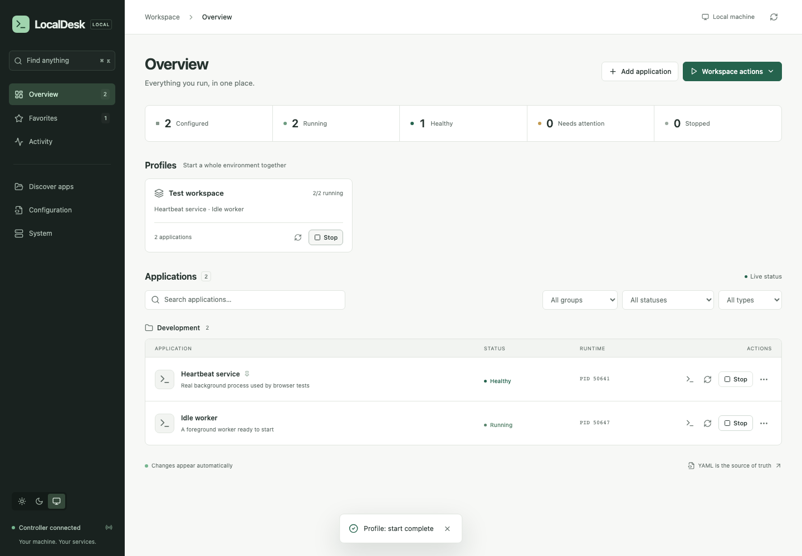

# LocalDesk

One place to run everything on your machine.

LocalDesk manages development servers, scripts, background workers, local tools, and Docker Compose projects without installing each application as an operating-system service. It combines a Go controller, an embedded React dashboard, a CLI, readable YAML configuration, and SQLite runtime history.



*Screenshot from the browser integration test. The listed applications are real disposable processes.*

## Build and run

Requires Go 1.23+ and Node.js 22+ **to build**. The resulting executable needs neither Node.js nor Go. Docker is optional.

```sh
make build
./bin/localdesk
```

The first launch creates `~/.localdesk/config.yml`, starts the controller at `http://127.0.0.1:49152`, and opens an authenticated browser session. The initial workspace is empty. Use **Discover apps** to scan a project directory and review suggested commands, or edit YAML directly.

Optionally copy `bin/localdesk` to a directory on your `PATH`. No installation script, OS service registration, cloud account, or telemetry is required. Running it again opens the existing dashboard.

```sh
localdesk --config /path/to/config.yml
LOCALDESK_CONFIG=/path/to/config.yml localdesk
localdesk --port 49160 --no-browser
localdesk open
```

Configuration path precedence: `--config`, `LOCALDESK_CONFIG`, then `~/.localdesk/config.yml`. Keep each workspace's configuration in a separate directory: its database, logs, lock, and launch records live beside it.

## A first application

```yaml
version: 1
server:
  host: 127.0.0.1
  port: 49152
  open_browser: true

groups:
  development:
    name: Development
    order: 10

apps:
  web:
    name: My web application
    group: development
    type: process
    cwd: ~/Development/my-web-app
    start:
      command: npm run dev
    health:
      type: http
      url: http://127.0.0.1:3000
      initial_delay: 3s
      failure_threshold: 3
    detect:
      type: tcp
      host: 127.0.0.1
      port: 3000
    ports:
      - name: Web
        port: 3000
    links:
      app: http://127.0.0.1:3000
    autostart: true
```

Change the directory, command and port to match an actual project. Missing directories and Compose files are validation errors. Read [configuration](docs/configuration.md), [process management](docs/process-management.md), [Docker](docs/docker.md), and [examples](docs/examples.md). [examples/config.yml](examples/config.yml) is a directly usable, non-autostarting workspace using ordinary Unix commands.

## Dashboard

- Profiles above grouped application rows; search, status/type/group filters, and favorites.
- Start, stop, restart, protected external detection, port occupancy, links, directory and terminal actions.
- App details with ownership, PID/group, uptime, launch instance, health samples, history, effective configuration, and Compose containers.
- Live stdout/stderr with pause, tail, search, wrapping, timestamps, stream filtering, copy, and download.
- `Cmd/Ctrl+K` command palette. Light, dark, and system themes. Responsive layout and keyboard focus.
- Optional YAML editor with highlighting, validation, conflict detection, backups, and reload. Raw YAML is concealed until explicitly revealed.
- Discovery suggestions require review and never start automatically. Global Stop All requires confirmation.
- Open a service's **More info** menu item (or click its name) for the project path and configured/detected ports. Running Compose services use Docker's published host ports automatically; no `ports` configuration is needed for detection. The Ports page lists local TCP listeners, UDP bindings and Docker-published ports, including processes outside LocalDesk, and refreshes every 15 seconds while open. Local socket inspection uses `lsof` (included on macOS; install it on Linux) and is limited to processes visible to your user. An absent listener is not a guarantee that a port is available.

## CLI

```sh
localdesk status                       # alias: list
localdesk start web
localdesk stop web
localdesk restart web
localdesk logs web
localdesk logs web --follow
localdesk profile start development
localdesk profile stop development
localdesk profile restart development
localdesk start --all
localdesk stop --all                   # prompts; --yes for unattended use
localdesk config validate
localdesk config path
localdesk config reload
localdesk init
localdesk backup
localdesk reset-state --yes
localdesk --version
```

Operational CLI commands use the running controller's authenticated localhost API. If none is running, they explain how to start one. `init`, `config path`, and `config validate` work without a controller. `backup` uses a consistent SQLite snapshot; `reset-state` requires the controller and all verified launches to be stopped. It preserves configuration, logs, and project directories.

## Architecture and safety

A runner registry implements **process**, **shell**, **docker-compose**, and **custom** behavior. The manager handles dependency graphs, health thresholds, profiles, lifecycle events, and bounded restart policies. React consumes REST and server-sent events. Built assets are embedded in the Go binary. See [architecture](docs/architecture.md) and [API](docs/api.md).

Each normal process launch gets a detached LocalDesk supervisor, a private authenticated Unix socket, and a separate workload process group. Supervisors capture rotating logs and survive controller exits. After a restart the controller authenticates to the supervisor before reclaiming ownership; it never kills a cached PID. Unverifiable launches block duplicate starts. External processes are protected; only an explicitly configured custom stop command can stop them.

The parent remains unreaped during descendant cleanup, preventing process-group ID reuse while signaling. TERM/INT/etc. is followed by KILL after the configured timeout. Programs that deliberately escape their process group by daemonizing need a custom runner with status and stop commands. This is a local control plane, not a sandbox for untrusted commands.

Localhost is the default. All API calls require a token; browser sessions use HttpOnly, SameSite cookies, Host checks, origin checks, and a custom mutation header. Non-loopback binding requires a 32-character token. HTTP is not encrypted: keep the service local or put authenticated TLS in front of it. Configuration, environment files, launch records, logs, and backups may contain secrets; keep the state directory private.

## Development

```sh
make dev            # backend + Vite HMR, isolated .dev/config.yml
make frontend       # reproducible npm install and production frontend
make build          # standalone bin/localdesk
make test           # Go race tests and frontend state tests
make lint           # Go vet/format and TypeScript checks
make integration    # disposable real-process end-to-end test
make docker-test    # disposable busybox Compose end-to-end test
make browser-test   # isolated desktop/mobile browser regression tests
make dist           # four CGO-free binaries
```

The development frontend is at `http://127.0.0.1:5173`; its proxy reads the development controller token. Keep Vite bound to localhost. `make dev` discovers the address configured in `.dev/config.yml`. Frontend dependencies use an npm lockfile. Go dependencies use `go.sum`. GitHub Actions tests on macOS/Linux and produces macOS/Linux arm64/amd64 artifacts without publishing releases.

## Persistence and operating limits

- `config.yml`: authoritative human-editable configuration.
- `state.db`: runtime snapshots, bounded health and lifecycle history.
- `launches/`: private launch credentials, resolved launch config/environment, and exit records.
- `logs/`: timestamped JSONL logs, rotated per launch and capped across launches per app.
- `instance.json`: current controller address/token. `instance.lock`: OS-backed single-instance lock.
- `internal.log`: controller diagnostics, rotated on startup above 5 MB.

Live reload keeps the last valid configuration, refuses removal of active apps, and leaves running launch configuration intact. Server binding/token changes require a controller restart. Restarting the computer stops workloads; launch LocalDesk to trigger configured autostart. LocalDesk does not register itself or apps with launchd/systemd.

Health is monitored by a bounded, serialized worker loop. Lifecycle operations are serialized for predictable ownership; very large workspaces or slow custom checks can delay other operations. Log views show up to 5,000 lines, downloads up to 10,000 recent lines; full retained JSONL files are in `logs/`. Favorites/theme are browser-local preferences. Discovery searches four directory levels and at most 20,000 entries. Windows has an explicit unsupported platform boundary pending a job-object implementation.
