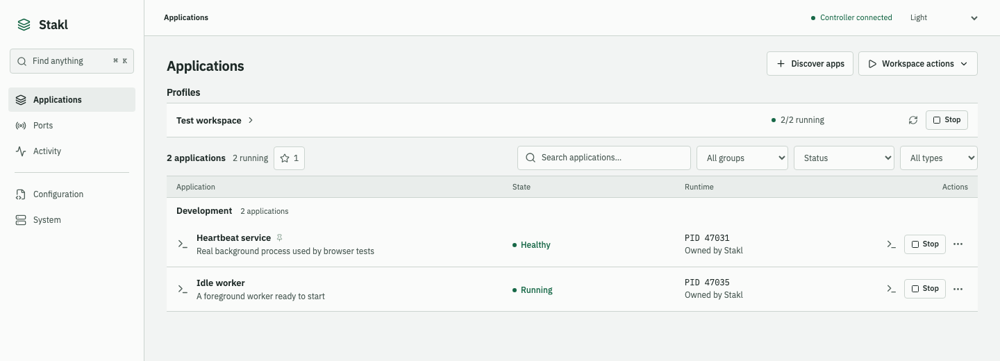
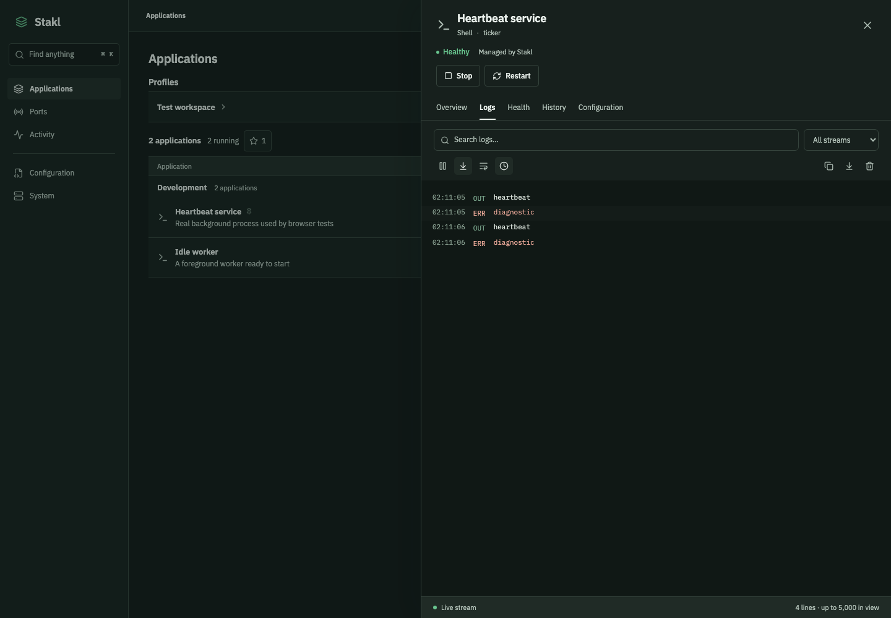
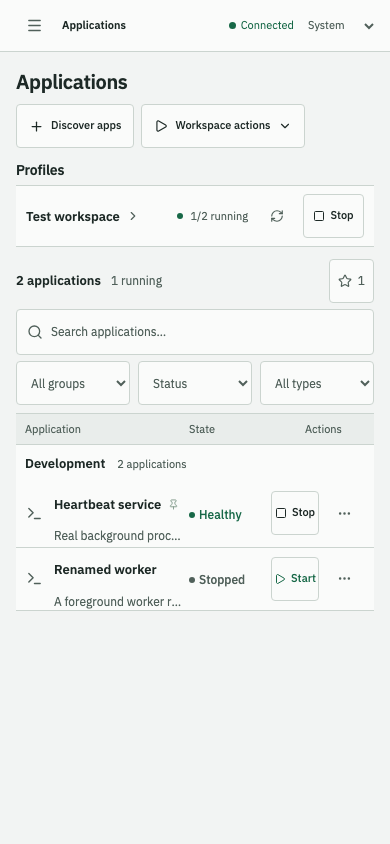

# Stakl

One place to run services on your machines.

Stakl manages development servers, scripts, background workers, local tools, and Docker Compose projects without installing each application as an operating-system service. It combines a Go controller, an embedded React dashboard, a CLI, readable YAML configuration, and SQLite runtime history.

<picture>
  <source media="(prefers-color-scheme: dark)" srcset="docs/images/dashboard-dark.png" />
  <source media="(prefers-color-scheme: light)" srcset="docs/images/dashboard.png" />
  
</picture>

*Current Applications view with real disposable test processes. [Light](docs/images/dashboard.png) · [Dark](docs/images/dashboard-dark.png).*

## Install

Tagged releases contain standalone macOS and Linux binaries for arm64 and amd64. Install the latest release without Go, Node.js, or administrator access:

```sh
curl -fsSL https://github.com/bhujelaayushgc/stakl/releases/latest/download/install.sh | sh
```

The installer detects the current platform, downloads the matching archive, verifies its SHA-256 checksum, and installs `stakl` to `~/.local/bin`. Add that directory to `PATH` if prompted, then run:

```sh
stakl
```

Rerun the installer to upgrade. Pin a version or choose another writable installation directory with environment variables:

```sh
curl -fsSL https://github.com/bhujelaayushgc/stakl/releases/latest/download/install.sh | STAKL_VERSION=v0.1.0 sh
curl -fsSL https://github.com/bhujelaayushgc/stakl/releases/latest/download/install.sh | STAKL_INSTALL_DIR=/usr/local/bin sh
```

The installer never starts Stakl or changes `~/.stakl`. To uninstall the executable, remove `~/.local/bin/stakl`; configuration and runtime history remain intact.

For a manual installation, download the archive for your platform and `checksums.txt` from GitHub Releases, verify the archive, then extract it:

```sh
grep 'stakl-darwin-arm64.tar.gz$' checksums.txt | shasum -a 256 -c -
tar -xzf stakl-darwin-arm64.tar.gz
./stakl-darwin-arm64
```

Linux users can replace `shasum -a 256` with `sha256sum`. Release binaries are not currently code-signed; macOS may require approval in **System Settings → Privacy & Security**. The first launch creates `~/.stakl/config.yml`, starts the controller at `http://127.0.0.1:49152`, and opens an authenticated browser session.

## Build and run

Requires Go 1.26+ and Node.js 22+ **to build**. The resulting executable needs neither Node.js nor Go. Docker is optional.

```sh
make build
./bin/stakl
```

The initial workspace is empty. Use **Discover apps** to scan a project directory and review suggested commands, or edit YAML directly.

Optionally copy `bin/stakl` to a directory on your `PATH`. No installation script, OS service registration, cloud account, or telemetry is required. Running it again opens the existing dashboard.

```sh
stakl --config /path/to/config.yml
STAKL_CONFIG=/path/to/config.yml stakl
stakl --port 49160 --no-browser
stakl open
```

Configuration path precedence: `--config`, `STAKL_CONFIG`, then `~/.stakl/config.yml`. Keep each workspace's configuration in a separate directory: its database, logs, lock, and launch records live beside it.

## Connected hosts

Run Stakl on each machine, issue a read or control peer grant there, then use **Hosts > Add host** on your dashboard controller. Supply the peer endpoint, grant token, and its public certificate PEM when using a self-signed certificate. [Setup instructions](docs/configuration.md#connecting-from-a-dashboard) cover native HTTPS and manual SSH tunnels.

Applications can show Local, one host, or All hosts. Host labels distinguish apps with identical IDs; logs, health, history, and start/stop/restart target the selected host. Unavailable snapshots show their last observation and do not count as currently running. Profiles, Ports, Activity, configuration editing, and workspace actions operate on the local controller. Removing a connection leaves peer services running.

## A first application

```yaml
version: 1
server:
  host: 127.0.0.1
  port: 49152
  open_browser: true

groups:
  development:
    name: Development
    order: 10

apps:
  web:
    name: My web application
    group: development
    type: process
    cwd: ~/Development/my-web-app
    start:
      command: npm run dev
    health:
      type: http
      url: http://127.0.0.1:3000
      initial_delay: 3s
      failure_threshold: 3
    detect:
      type: tcp
      host: 127.0.0.1
      port: 3000
    ports:
      - name: Web
        port: 3000
    links:
      app: http://127.0.0.1:3000
    autostart: true
```

Change the directory, command and port to match an actual project. Missing directories and Compose files are validation errors. Read [configuration](docs/configuration.md), [process management](docs/process-management.md), [Docker](docs/docker.md), and [examples](docs/examples.md). [examples/config.yml](examples/config.yml) is a directly usable, non-autostarting workspace using ordinary Unix commands.

## Dashboard

The dashboard uses a compact workstation layout with a neutral navigation rail, flat application and profile rows, and locally bundled IBM Plex fonts. **Applications**, **Ports**, **Activity**, **Configuration**, and **System** are the main destinations.

- Profiles above grouped application rows; inline running/attention counts, search, status/type/group filters, and a favorites filter.
- Direct start/stop and log controls; **More actions** for restart, links, directory and terminal actions. Ownership and health stay visible in the application list; externally detected processes are protected.
- App details with ownership, PID/group, uptime, launch instance, health samples, history, effective configuration, and Compose containers.
- Live stdout/stderr with pause, tail, search, wrapping, timestamps, stream filtering, copy, and download.
- `Cmd/Ctrl+K` command palette. Light, dark, and system themes in the utility bar beside controller connection status. Mobile navigation drawer, responsive rows, and visible keyboard focus.
- Shareable destination URLs preserve the current view, application filters, and detail tab; browser back/forward navigation restores them.
- Optional YAML editor with highlighting, validation, conflict detection, backups, and reload. Raw YAML is concealed until explicitly revealed.
- Discovery suggestions require review and never start automatically. Global Stop All requires confirmation.
- Open a service's **More info** menu item (or click its name) for the project path and configured/detected ports. Running Compose services use Docker's published host ports automatically; no `ports` configuration is needed for detection. The Ports page lists local TCP listeners, UDP bindings and Docker-published ports, including processes outside Stakl, and refreshes every 15 seconds while open. Local socket inspection uses `lsof` (included on macOS; install it on Linux) and is limited to processes visible to your user. An absent listener is not a guarantee that a port is available.

<details>
<summary>Live logs</summary>



</details>

<details>
<summary>Mobile Applications view</summary>



</details>

Screenshots come from the isolated Chromium browser tests. See [Contributing](CONTRIBUTING.md#refresh-ui-screenshots) to refresh them.

## CLI

```sh
stakl status                       # alias: list
stakl start web
stakl stop web
stakl restart web
stakl logs web
stakl logs web --follow
stakl profile start development
stakl profile stop development
stakl profile restart development
stakl start --all
stakl stop --all                   # prompts; --yes for unattended use
stakl config validate
stakl config path
stakl config reload
stakl init
stakl tls init --host peer.example
stakl peer tokens create --name Laptop --access read
stakl peer tokens list
stakl peer tokens revoke GRANT_ID
stakl backup
stakl reset-state --yes
stakl --version
```

Operational CLI commands use the running controller's authenticated API, automatically trusting its configured public certificate under HTTPS. If none is running, they explain how to start one. `init`, `tls init`, `config path`, and `config validate` work without a controller. See [HTTPS and headless setup](docs/configuration.md#https-and-headless-peers) for certificate generation, public PEM transfer, and scoped peer credentials. `backup` uses a consistent SQLite snapshot; TLS certificates and keys require separate backups. `reset-state` requires the controller and all verified launches to be stopped. It preserves configuration, logs, and project directories.

## Architecture and safety

A runner registry implements **process**, **shell**, **docker-compose**, and **custom** behavior. The manager handles dependency graphs, health thresholds, profiles, lifecycle events, and bounded restart policies. React consumes REST and server-sent events. Built assets are embedded in the Go binary. See [architecture](docs/architecture.md) and [API](docs/api.md).

Each normal process launch gets a detached Stakl supervisor, a private authenticated Unix socket, and a separate workload process group. Supervisors capture rotating logs and survive controller exits. After a restart the controller authenticates to the supervisor before reclaiming ownership; it never kills a cached PID. Unverifiable launches block duplicate starts. External processes are protected; only an explicitly configured custom stop command can stop them.

The parent remains unreaped during descendant cleanup, preventing process-group ID reuse while signaling. TERM/INT/etc. is followed by KILL after the configured timeout. Programs that deliberately escape their process group by daemonizing need a custom runner with status and stop commands. This is a local control plane, not a sandbox for untrusted commands.

Localhost is the default. All API calls require a token; browser sessions use HttpOnly, SameSite cookies, Host checks, origin checks, and a custom mutation header. Native HTTPS also marks cookies Secure. Non-loopback binding requires a 32-character administration token. Configure native HTTPS before remote access; scoped peer credentials are accepted only over TLS or loopback transport. Configuration, environment files, launch records, logs, and backups may contain secrets; keep the state directory private.

## Development

```sh
make dev            # backend + Vite HMR, isolated .dev/config.yml
make frontend       # reproducible npm install and production frontend
make build          # standalone bin/stakl
make test           # Go race tests and frontend state tests
make lint           # Go vet/format and TypeScript checks
make integration    # disposable real-process end-to-end test
make docker-test    # disposable busybox Compose end-to-end test
make browser-test   # isolated desktop/mobile browser regression tests
make dist           # four CGO-free binaries
```

The development frontend is at `http://127.0.0.1:5173`; its proxy reads the development controller token. Keep Vite bound to localhost. `make dev` discovers the address configured in `.dev/config.yml`. Frontend dependencies use an npm lockfile. Go dependencies use `go.sum`. GitHub Actions tests on macOS/Linux and publishes checksummed macOS/Linux arm64/amd64 archives for `v*` tags.

See [CONTRIBUTING.md](CONTRIBUTING.md) before sending changes and [SECURITY.md](SECURITY.md) for private vulnerability reporting. Stakl is available under the [MIT License](LICENSE).

## Persistence and operating limits

- `config.yml`: authoritative human-editable configuration.
- `state.db`: runtime snapshots, bounded health and lifecycle history.
- `launches/`: private launch credentials, resolved launch config/environment, and exit records.
- `logs/`: timestamped JSONL logs, rotated per launch and capped across launches per app.
- `instance.json`: current controller address/token. `instance.lock`: OS-backed single-instance lock.
- `internal.log`: controller diagnostics, rotated on startup above 5 MB.

Live reload keeps the last valid configuration, refuses removal of active apps, and leaves running launch configuration intact. Server binding/token/TLS changes require a controller restart. Restarting the computer stops workloads; launch Stakl to trigger configured autostart. Stakl does not register itself or apps with launchd/systemd.

Health is monitored by a bounded, serialized worker loop. Lifecycle operations are serialized for predictable ownership; very large workspaces or slow custom checks can delay other operations. Log views show up to 5,000 lines, downloads up to 10,000 recent lines; full retained JSONL files are in `logs/`. Favorites/theme are browser-local preferences. Discovery searches four directory levels and at most 20,000 entries. Windows has an explicit unsupported platform boundary pending a job-object implementation.
